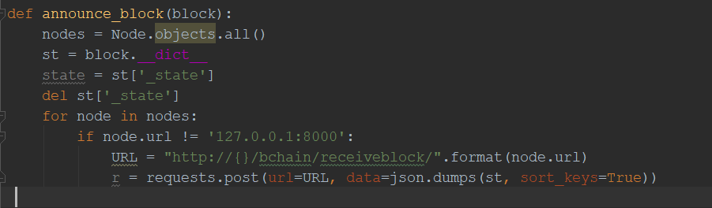
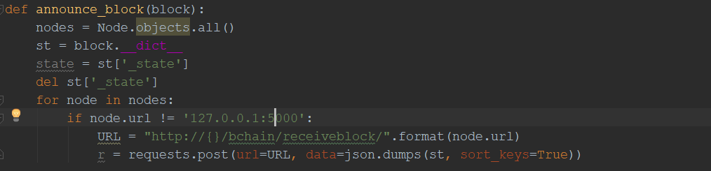

## Setup :
 1. Create a folder "peers"(or any name you like) on your desktop.
 2. In the folder create three folders "5000","8000" and "4000".
 3. Now copy the project on each of these folders.
 

##  How to run it:
1. Go to  views.py of bchain app in the blockchain project   for each folder 
2. In each of views.py check the announce_block function.

3. Change the port number in node.url  in the "5000"   and "4000" folder to 5000 and 4000 respectively.For instance-

 4. Go to the  terminal for each of the folder and type the following commands
 For 8000 terminal type the command
     
     py manage.py runserver 8000
 
  Similarly for 5000
     
     py manage.py runserver 5000
     
  and for 4000   
     
     py manage.py runserver 4000
    
     
     
     
     
