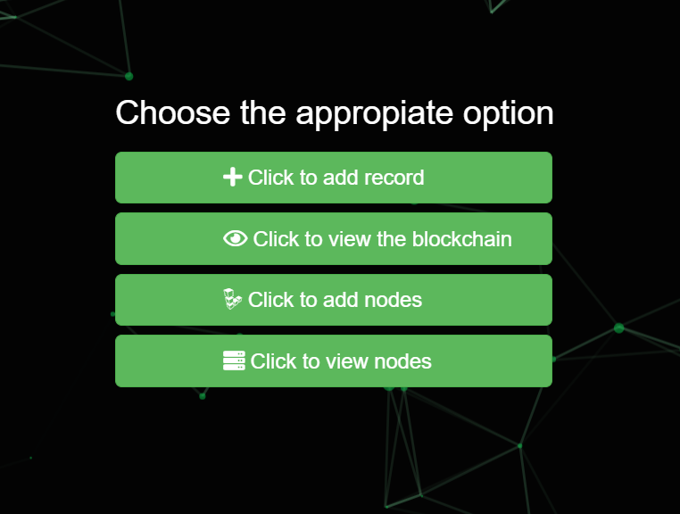

A small demo is given below.
# ILLUSTRATION

## Setup :
 1. Create a folder "peers"(or any name you like) on your desktop.
 2. In the folder create three folders "5000","8000" and "4000".
 3. Now copy the project on each of these folders.
 

##  How to run it:
1. Go to  views.py of bchain app in the blockchain project   for each folder 
2. In each of views.py check the announce_block function.

3. Change the port number in node.url  in the "5000"   and "4000" folder to 5000 and 4000 respectively.For instance-

 4. Go to the  terminal for each of the folder .
 
 For 8000 terminal type the command
     
     py manage.py runserver 8000
 
  Similarly for 5000
     
     py manage.py runserver 5000
     
  and for 4000   
     
     py manage.py runserver 4000
    
##  Adding nodes
For the API to function properly add the nodes as per the port and keep the server of all the nodes running.

For instance, if we are in the node  127.0.0.1:8000
1. Then go to any web browser and type the url [http://127.0.0.1:8000/bchain/index/](http://127.0.0.1:8000/bchain/index/)

2. A  Dashboard   appears

     
 3. By clicking on "Click to add nodes" we are redirected to the following page
 
 
 4. Add the node url of other peers excluding the present node address.(In this case add 127.0.0.1:5000 and 127.0.0.1:4000  excluding 127.0.0.1:8000)
 
 The same process is repeated for 127.0.0.1:5000 and 127.0.0.1:4000
